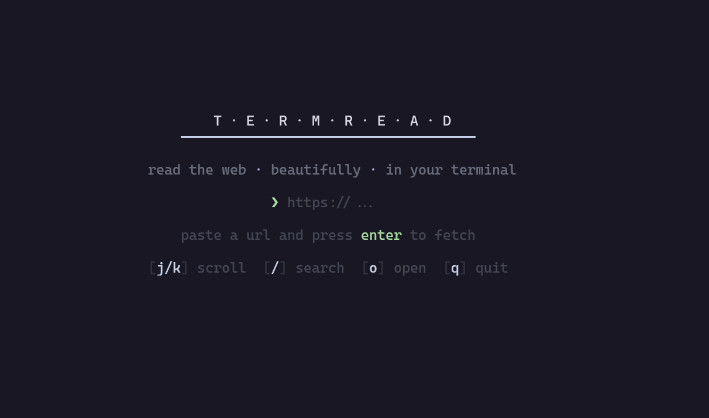
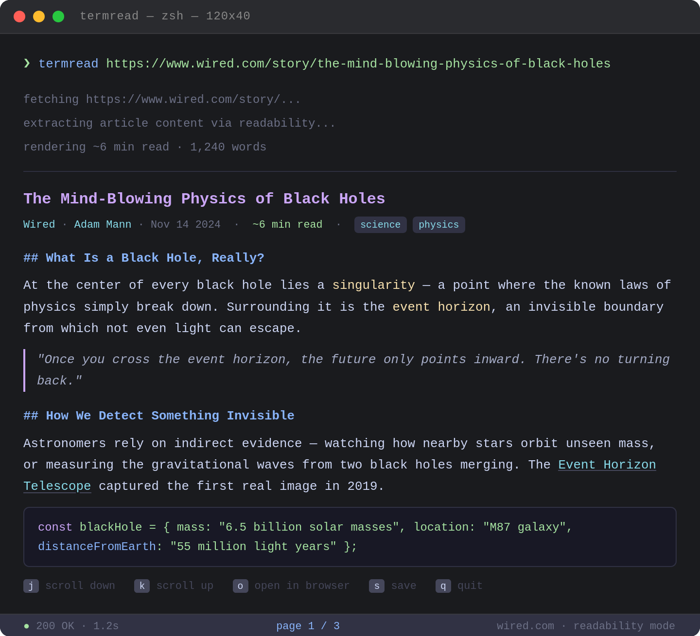

# termread

> Read any article, beautifully, in your terminal.

`termread` fetches any URL, strips out the noise (ads, nav, popups), and renders clean, readable content right in your terminal — like Firefox Reader Mode, but for your shell.

<!-- splash screen screenshot -->


---

## install

**Requirements:** [Bun](https://bun.sh) v1.0+

**Set up as a command (recommended):**
```bash
git clone https://github.com/ftbhabuk/termread.git
cd termread
bun install

# add alias to your shell
echo 'alias termread="bun run '$(pwd)'/cli.ts"' >> ~/.zshrc
source ~/.zshrc
```

Other shells:
Use your shell’s rc file instead of `~/.zshrc` (for example: `~/.bashrc` for Bash, `~/.config/fish/config.fish` for Fish).

**Or run directly without installing:**
```bash
bun run cli.ts https://example.com/article
```

---

## docker

No local dependencies needed — only Docker required.

**Use the pre-built image:**
```bash
# latest stable release
docker run --rm -it ghcr.io/ftbhabuk/termread:latest https://example.com/article

# current snapshot (built from every main commit)
docker run --rm -it ghcr.io/ftbhabuk/termread:snapshot https://example.com/article
```

**Or build locally** (with [just](https://github.com/casey/just)):
```bash
just image                                       # build the Docker image
just run https://example.com/article            # interactive pager
just raw https://example.com/article            # plain text / pipe-friendly
just build                                       # compile binary via Docker → ./termread
```

The `-it` flag allocates a terminal for the interactive pager. Without it, add `--raw` for plain text output.

**Pipe-friendly plain text:**
```bash
docker run --rm ghcr.io/ftbhabuk/termread:latest https://example.com/article --raw | grep "keyword"
docker run --rm ghcr.io/ftbhabuk/termread:latest https://example.com/article --raw > article.txt
```

---

## usage

```bash
termread <url> [options]
```

### options

| flag | description |
|------|-------------|
| `--raw` | plain text output, great for piping |
| `--no-color` | disable ANSI colors |
| `--help` | show help |
| `--version` | show version |

### examples

<!-- usage example screenshot -->


```bash
# read an article
termread https://www.wired.com/story/some-article

# pipe-friendly plain text
termread https://example.com/article --raw | grep "keyword"

# save as text
termread https://example.com/article --raw > article.txt

# chain with other tools
termread https://example.com/article --raw | wc -w
```

---

## keyboard shortcuts

| key | action |
|-----|--------|
| `j` / `↓` | scroll down |
| `k` / `↑` | scroll up |
| `d` | half page down |
| `u` | half page up |
| `Space` / `f` | full page down |
| `b` | full page up |
| `g` | go to top |
| `G` | go to bottom |
| `/` | search |
| `Enter` | confirm search / open selected link |
| `Esc` | cancel search |
| `Backspace` | delete search char |
| `n` | next search result |
| `e` | expand/collapse links |
| `o` | open a link by number |
| `h` | go back to previous article |
| `q` | quit |

Press `o`, type a link number from the Links section, then press `Enter` to open it inside `termread`.

---

## how it works

```
URL
 └─► fetch HTML (realistic browser headers)
      └─► @mozilla/readability  ← same algo as Firefox!
           └─► turndown (HTML → Markdown)
                └─► custom ANSI renderer
                     └─► interactive pager (vim-style keys)
```

---

## stack

- **Runtime**: Bun
- **Extraction**: @mozilla/readability (same as Firefox reader mode)
- **HTML→MD**: turndown
- **Colors**: chalk (Catppuccin Mocha theme)
- **DOM**: jsdom
